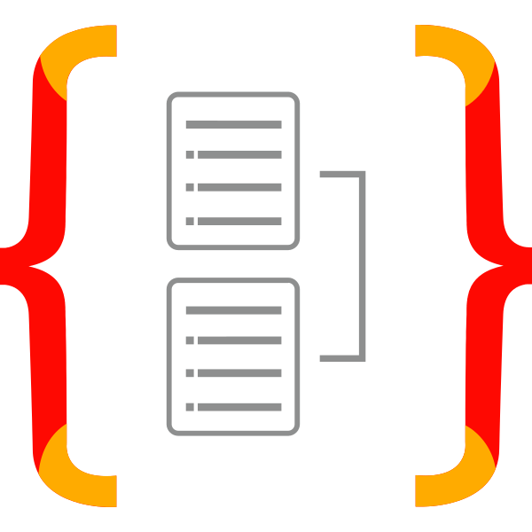

# Work on Private Repositories

This repository aims to provide an overview of the private repositories that I work / have worked on. They are private due to the strictly confidential nature of the projects.

Table of contents:

- [EasyLaw](#1-easylaw)
- [Folio](#2-folio)

## 1. EasyLaw

EasyLaw is a platform that allows legal professionals to manage customs counterfeit goods retention for their clients (brands which legal rights are infringed). It is a desktop application built with PyQT. It generates 3 major types of documents based on the data entered by the legal professionals:

- Formal notices to be sent to opposing parties that imported counterfeit goods (either by post or physically). These are generated as `Word documents`. There are about 80 templates depending on the client, the opposing party's language, the mean of transport of the goods,...
- Analytic and synthetic reports in the form of `Excel documents`. These documents are destined to the clients and are specifically tailored to each client's needs.
- Reports for the customs authorities. These are `Word documents` destined to a specific customs office, with the necessary data to allow them to destroy the counterfeit goods (identifiers, client involved, etc.)

EasyLaw's data is centralised on a server, and thus can be used by multiple legal professionals at once.

Before the development of EasyLaw, the legal professionals had to manually generate the documents and handle all the data during the whole process (which can take multiple weeks). This was a hugely time-consuming, error-prone, and mentally exhausting process. Since the production launch of EasyLaw in January 2024, <u>the legal professionals saved hundreds of hours</u> of repetitive work and can now focus on more complex issues.

### Challenges

As this was my first real software engineering experience, I had to learn a lot of things and faced many challenges. One of them was the <u>generation of Word documents</u>, which can be a real hassle. Another one was the <u>massive amount of data</u> and especially all the details and different possible combinations of the data. Lastly, I learned a lot about <u>developer-client communication</u> and how to <u>understand the expectations of the clients</u>.

It sure was a great experience and I learned a lot from it. Plus the project was a success and the clients are greatly satisfied, so overall a great success!

### Stack and tools

### Stats

 

## 2. Folio

Folio is a platform that allows legal professionals to manage a portfolio of trademarks, patents, designs and domain names for their clients. It is a project I am working on at the request of EasyLaw's clients. This time its a web platform built using NestJS and Angular and deployed on the client's server using Docker. It has three major goals:

- Improve efficiency and reduce time spent handling repetitive tasks
- Reduce human error
- Centralise and standardise portfolios across the lawyers of the law firm

On top of managing the portfolios directly in the software, Folio also produces documents (`Excel` and `PDF`) and pre-fills mails addressed to the firm's clients. To help users get started and make sure they keep using it without help, I also wrote a built-in help center (built with MkDocs) documenting every feature and workflow.

I started coding this project entirely by hand. Then, about halfway through, I gradually switched to LLM-assisted development (Claude Code) to ship faster while keeping control of the code. I am an enthusiastic developer and enjoye writing code myself, but I also know that it is essential to learn how to work with AI, and it was a great way to learn hands-on.

### Challenges
As with EasyLaw, this project came with challenges. One of them was understanding the inner workings of Intellectual Property (IP) laws, how they work in Switzerland and globally. I also had to take into account the diverse workflows and habits of each lawyer to make sure the software was as easy to use and as natural as possible for them. On top of that, the software is used by multiple people with different access levels and roles, which made me learn how to handle and implement secure user accounts, role-based access, ... Finally, I wanted to make sure the UX was on point so I put a lot of work into polishing that, checking in regularly with the end users.

On the other hand, I benefited from experience gained during EasyLaw's development. For instance, I already had lots of tools to generate `Excel documents` with Python code which I reused here.

### Stack and tools

### Stats

